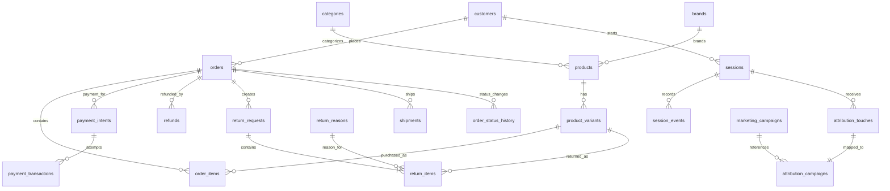

# E-commerce SQL Analytics Case Study

Business analysis of an ecommerce PostgreSQL database using SQL to answer ten stakeholder-driven business questions across growth, marketing, finance, operations, and customer analytics.

---

## Project Overview

This project analyzes an ecommerce business using SQL to uncover actionable business insights.

**The analysis covers:**

- Daily business performance and revenue trends
- Customer cohort retention
- Marketing funnel conversion
- Product profitability after refunds
- Category performance and return rates
- Payment failure analysis
- Delivery SLA compliance
- Customer lifetime value (LTV)
- Repeat purchase behaviour
- First-touch vs. last-touch marketing attribution

---

## Skills Demonstrated

- PostgreSQL
- Complex Joins
- Common Table Expressions (CTEs)
- Window Functions (`lag`, `lead`, `row_number`)
- Cohort Analysis
- Funnel Analysis
- Marketing Attribution
- Customer Lifetime Value (LTV)
- Percentile Analysis (`percentile_cont`)
- Business KPI Analysis
- Data Storytelling

---

## Database Schema

---

## Query Summary

| Query                                                | Stakeholder         | Business Question                                                    | SQL Concepts                               |
| :--------------------------------------------------- | :------------------ | :------------------------------------------------------------------- | :----------------------------------------- |
| [Q1](queries/q1_daily_business_summary.sql)          | CEO                 | How is the business performing day-to-day?                           | CTEs, `lag()`, DoD & WoW comparisons       |
| [Q2](queries/q2_monthly_signup_cohort_retention.sql) | Growth              | How well are new customer cohorts retained?                          | Cohort analysis, conditional aggregation   |
| [Q3](queries/q3_funnel_conversion_by_channel.sql)    | CMO                 | Where do customers drop off across the marketing funnel?             | FILTER clause, funnel analysis             |
| [Q4](queries/q4_product_net_revenue.sql)             | CFO                 | Which products generate the highest net revenue after refunds?       | Multi-CTEs, proportional refund allocation |
| [Q5](queries/q5_category_health.sql)                 | Category Manager    | Which categories drive revenue and returns?                          | Multi-table joins, return rate calculation |
| [Q6](queries/q6_payment_failure_analysis.sql)        | Payments PM         | Which payment methods fail most, and why?                            | Window ranking, Top-N per group            |
| [Q7](queries/q7_delivery_sla.sql)                    | Operations Head     | Which carriers miss delivery SLAs?                                   | Percentiles, FILTER aggregation            |
| [Q8](queries/q8_customer_ltv.sql)                    | CRM Lead            | Who are the highest-value customers?                                 | CASE expressions, window functions         |
| [Q9](queries/q9_repeat_purchase_interval.sql)        | Lifecycle Marketing | When do customers typically return for another purchase?             | `lead()`, percentiles                      |
| [Q10](queries/q10_attribution_comparison.sql)        | Marketing           | How does revenue attribution change under first-touch vs last-touch? | `row_number()`, window functions           |

---

## Case Study

A detailed business memo summarizing the key findings from all ten analyses is available in **[CASE_STUDY.md](CASE_STUDY.md)** and also at the [Notion Link](https://able-bat-6e9.notion.site/What-10-SQL-Queries-Told-Me-About-This-Business-39c85cc041fb805fb90ae9086b1d8d68?source=copy_link).

The case study includes:

- Executive summary
- Five business insights
- Recommended next investigations
- Methodology and assumptions

---

## How to Run

- Connect to the internal **Metabase** PostgreSQL instance.
- Select the **`ecom`** schema.
- Open any query from the `queries/` directory.
- Run the query in the SQL editor.
- Each query includes:
  - Business question
  - Sanity checks
  - SQL implementation
  - Clear formatting following the project SQL style guide

---

## Assumptions

- Cancelled orders are excluded where appropriate.
- Orders without attribution touches are bucketed as **`direct`**.
- Delivery SLA calculations exclude shipments still in transit.
- Customer retention is calculated using completed (non-cancelled) orders.
- Repeat purchase analysis compares both including and excluding same-day repeat purchases.

---

## Reflection

### What I learned

Working through the analyses highlighted the importance of understanding both the data model and the business context before writing SQL. Small implementation choices such as handling attribution, filtering incomplete data, or defining retention can materially change the conclusions.

### What I'd do differently

I'd expand the project beyond SQL by building dashboards for continuous monitoring and validating the findings with additional data, such as acquisition costs, customer segments, and experiment results.

---

## Author

**Adyasha Mahanta**

LinkedIn: https://www.linkedin.com/in/adyasha-mahanta-13280121b/
