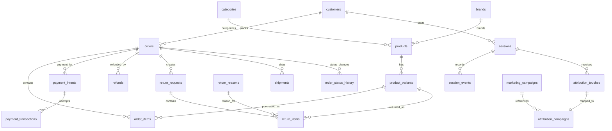

## A. Table Inventory

| **table**              | **approx_rows** | **what it stores**                                                         | **grain**                                                                    |
| ---------------------- | --------------- | -------------------------------------------------------------------------- | ---------------------------------------------------------------------------- |
| session_events         | 292,903         | events per customer session                                                | 1 row = 1 event during the session                                           |
| order_status_history   | 158,414         | history of order status changes                                            | 1 row = 1 status change for 1 order                                          |
| experiment_assignments | 140,670         | records of sessions being assigned to A/B test variants                    | 1 row = 1 experiment assignment for a session                                |
| attribution_touches    | 100,000         | marketing attribution touchpoints for sessions                             | 1 row = 1 marketing touch for a session                                      |
| sessions               | 100,000         | customer sessions on the site                                              | 1 row = 1 customer session                                                   |
| devices                | 85,168          | used device information                                                    | 1 row = 1 used device information                                            |
| order_items            | 81,806          | information about  variants in orders                                      | 1 row = 1 variant line in an order                                           |
| payment_transactions   | 40,034          | information about customer payment transactions                            | 1 row = 1 payment transaction                                                |
| orders                 | 40,000          | master order table                                                         | 1 row = 1 order per customer                                                 |
| payment_intents        | 40,000          | payment infomation for orders                                              | 1 row = 1 payment information                                                |
| attribution_campaigns  | 38,405          | maps marketing touches to campaigns and stores attributed advertising cost | 1 row = 1 touch-to-campaign attribution                                      |
| shipments              | 32,089          | master shipment table                                                      | 1 row = 1 shipment information                                               |
| inventory_movements    | 30,207          | records every stock movement in and out of warehouses.                     | 1 row = 1 inventory movement for one product variant                         |
| prices                 | 24,180          | prices for product variant during a specific validity period               | 1 row = one price for one product variant during a specific validity period. |
| loyalty_transactions   | 21,475          | records for loyalty points transactions                                    | 1 row = one loyalty points transaction                                       |
| segment_memberships    | 16,461          | customer memberships in segments during a validity period                  | 1 row = one customer's membership in one segment during a validity period    |
| addresses              | 16,000          | master address table                                                       | 1 row = 1 address                                                            |
| customer_addresses     | 16,000          | maps addresses to customers                                                | 1 row = 1 address type of 1 customer                                         |
| product_variants       | 12,090          | product variants and their attributes                                      | 1 row = 1 variant of a product                                               |
| customers              | 10,000          | master customer table                                                      | 1 row = 1 customer                                                           |
| product_reviews        | 8,000           | product reviews by customers                                               | 1 row = 1 review of a product by 1 customer                                  |
| product_images         | 7,188           | images of products                                                         | 1 row = 1 image of 1 product                                                 |
| notifications          | 6,856           | records of notifications and their related informations                    | 1 row = 1 notification                                                       |
| products               | 4,000           | master product table                                                       | 1 row = 1 product                                                            |
| loyalty_accounts       | 3,000           | loyalty accounts and their tiers                                           | 1 row = 1 loyalty account                                                    |
| return_items           | 2,004           | records for item returned along with reasons                               | 1 row = 1 return request of one variant                                      |
| inventory_items        | 2,000           | inventory records for variant items with warehouse status                  | 1 row = 1 inventory record of 1 variant                                      |
| return_requests        | 1,603           | records of return requests                                                 | 1 row = 1 return request                                                     |
| refunds                | 260             | records of refunds and their status                                        | 1 row = 1 refund request                                                     |
| brands                 | 120             | record of brands                                                           | 1 row = 1 brand                                                              |
| marketing_campaigns    | 100             | records of campaigns                                                       | 1 row = 1 campaign                                                           |
| coupons                | 50              | records of active coupons                                                  | 1 row = 1 coupon                                                             |
| promotion_rules        | 30              | eligibility rules for promotional offers                                   | 1 row = 1 rule associated with a promotion                                   |
| promotions             | 20              | records of active promotions                                               | 1 row = 1 promotion                                                          |
| categories             | 18              | category table with parent categories                                      | 1 row = 1 category                                                           |
| experiment_variants    | 12              | A/B experiment variants                                                    | 1 row = 1 experiment variant                                                 |
| customer_segments      | 10              | segments of customer                                                       | 1 row = 1 customer segment                                                   |
| return_reasons         | 8               | reasons for returns                                                        | 1 row = 1 return reason                                                      |
| experiments            | 6               | A/B experiments list and status                                            | 1 row = 1 experiment                                                         |
| payment_methods        | 5               | table of payment methods                                                   | 1 row = 1 payment method                                                     |
| shipping_methods       | 3               | table of shipping methods                                                  | 1 row = 1 shipping method                                                    |
| shipping_carriers      | 3               | table of shipping carriers                                                 | 1 row = 1 shipping carrier                                                   |
| price_lists            | 2               | pricing list country wise                                                  | 1 row = 1 pricing list                                                       |
| collections            | 0               | NA                                                                         | NA                                                                           |
| collection_products    | 0               | NA                                                                         | NA                                                                           |
| consents               | 0               | NA                                                                         | NA                                                                           |

| views            | approx_rows | what it stores                      | grain                                 |
| ---------------- | ----------- | ----------------------------------- | ------------------------------------- |
| session_channels | 100,000     | records of sessions channels        | 1 row = 1 session channel             |
| order_refund     | 260         | records of total refunds for orders | 1 row = 1  refund total for one order |
## B. Per-Column Notes

#### orders
- `order_id` — PK,  joins to order_items.order_id, payment_intents.order_id, refunds.order_id, shipments.order_id, order_status_history.order_id
- `order_number` — text 
- `created_at` — timestamp, order placed time, UTC, (min: March 16, 2026, 12:13 AM, max: June 14, 2026, 11:28 PM) 
- `customer_id` — FK to customers.customer_id, nullable 
- `session_id` — FK to sessions.session_id, nullable
- `cart_id` — uuid, nullable 
- `price_list_id` — FK to price_lists.price_list_id, nullable
- `status` — categorical  
	delivered	-19,779
	shipped - 7,715
	paid	- 3,946
	packed - 3,887
	cancelled	- 2,178
	placed	- 1,897
	SHIPPED - 248
	DELIVERED - 200
	Shipped - 150
	
- `subtotal` - numeric, currency amounts, (149,141,593)
- `discount` - numeric, currency amounts, (0,0), 0 here means no discount
- `tax`- numeric, currency amounts, (0,25,486.74), 0 here means no tax
- `shipping_fee` - numeric, currency amounts, (0, 59), 0 here means no shipping fee
- `total` - numeric, currency amounts, (175.82, 167,079.74)
- `payment_status` — categorical 
	paid -	37,822
	failed- 2,178
- `shipping_address_id, billing_address_id` — FK to addresses.address_id, nullable
- `applied_coupon_id` — FK to coupons.coupon_id, nullable
- `applied_promo_id` — FK to promotions.promo_id, nullable

#### order_items
- `order_id` — FK to orders.order_id
- `variant_id` — FK to product_variants.variant_id
- `qty` — numeric, units purchased in this line, (1,4)
- `unit_price` — numeric, price per unit at time of order, (149	45,499)
- `line_discount` — numeric, (0,0)
- `line_total` — numeric, (149, 104,997)
#### customers
- `customer_id` — PK, joins to orders.customer_id, sessions.customer_id,  loyalty_transactions.customer_id, loyalty_accounts. customer_id, notifications.customer_id, product_reviews.customer_id, consents.customer_id, customer_addresses.customer_id, experiment_assignments.customer_id, return_requests.customer_id, segment_memberships.customer_id, session_events.customer_id
- `created_at` — timestamp, UTC, signup time , (March 16, 2026, 11:03 AM- June 14, 2026, 10:57 AM)
- `first_name`, `last_name` — text 
- `dob` — date, nullable, (January 1, 1900,	December 31, 2099)
- `gender` — categorical 
	male-	4,824
	female- 4,736
	other- 	227
	null - 213
- `primary_email`, `primary_phone` — text
- `country`, `state`, `city` — categorical 
	India	7,641
	United States	1,359
	null 500
	N/A	300
	null 200
- `is_email_verified`, `is_phone_verified`, `marketing_opt_in` — boolean
- `lifecycle_stage` — categorical 
	active	4,869
	at_risk	3,903
	new	1,200
	churned	28
- `acquisition_channel` — categorical
	organic	4,023
	paid	3,490
	referral	1,192
	email	708
	affiliate	587
- `source` - categorical 
	affiliate	1,446
	direct	1,424
	google	1,395
	linkedin	1,496
	meta	1,421
	newsletter	1,422
	youtube	1,396
- `utm_campaign`
	brand_push	1,592
	clearance	1,734
	diwali_sale	1,638
	new_user	1,709
	retargeting	1,726
	winter_drop	1,601
- `utm_medium`
	cpc	1,642
	email	1,633
	none	1,618
	referral	1,790
	social	1,619
	video	1,698
- `utm_source` — text, categorical 
	affiliate	1,446
	direct	1,424
	google	1,395
	linkedin	1,496
	meta	1,421
	newsletter	1,422
	youtube	1,396

#### session_events
- `event_id` — PK
- `session_id` — FK to sessions.session_id, 
- `customer_id` — FK to customers.customer_id, nullable (anonymous sessions)
- `event_type` — categorical 
	product_view	158,441
	add_to_cart	43,120
	begin_checkout	19,240
	add_address	18,678
	select_shipping	18,381
	add_payment	18,160
	purchase	16,883
- `occurred_at` — timestamp - session started -(April 19, 2026, 12:08 AM, June 14, 2026, 11:28 PM)
- `product_id` — FK to products.product_id, nullable
- `variant_id` — FK to product_variants.variant_id, nullable
- `quantity`, `unit_price` — numeric, nullable (only relevant for cart/purchase events)
- `order_id` — FK to orders.order_id, nullable (only set on purchase events?)

#### attribution_touches
- `touch_id` — PK, joins to attribution_campaigns.touch_id
- `session_id` — FK to sessions.session_id, nullable
- `touched_at` — timestamp, when the touch occurred, (March 15, 2026, 11:49 PM, June 14, 2026, 11:17 PM)
- `utm_source`, `utm_medium`, `utm_campaign`, `utm_term`, `utm_content` — text 
- `channel` — categorical 
	organic	39,924
	paid	34,905
	referral	12,146
	email	6,995
	affiliate	6,030
- `referrer` — text

#### payment_intents
- `payment_intent_id` — PK, joins to payment_transactions.payment_intent_id
- `order_id` — FK to orders.order_id, nullable 
- `created_at` — timestamp- (March 16, 2026, 12:13 AM, June 14, 2026, 11:28 PM)
- `payment_method_id` — FK to payment_methods.payment_method_id, nullable
- `amount` — numeric
- `status` — categorical 
	succeeded	38,134
	failed	1,866

#### payment_transactions 
- `txn_id` — PK
- `payment_intent_id` — FK to payment_intents.payment_intent_id, nullable
- `txn_time` — timestamp, transaction time, (March 16, 2026, 12:13 AM,	June 14, 2026, 11:28 PM)
- `gateway` — text
- `status` — categorical 
	succeeded	38,134
	failed	1,900
- `error_code`- categorical , nullable
	BANK_DECLINE	443
	FRAUD	427
	GATEWAY_TIMEOUT	168
	NETWORK	419
	UPI_TIMEOUT	443
	null - 38,134 (no error)
- `error_message` — categorical, nullable 
	Gateway did not respond within 30s	168
	Payment failed	1,732
	null 38,134 (no error)

#### sessions
- `session_id` — PK
- `started_at`— timestamp, nullable, session started time, (March 15, 2026, 11:49 PM,	June 14, 2026, 11:17 PM)
- `ended_at` — timestamp, nullable, session ended time, (March 16, 2026, 12:04 AM,	June 14, 2026, 11:41 PM)
- `customer_id` — FK to customers.customer_id, nullable (anonymous)
- `anonymous_id` — uuid, nullable — tracks anonymous users before login
- `device_id` — FK to devices.device_id, nullable
- `ip_address` — inet
- `country`, `region`, `city` — text
- `landing_page`, `referrer` — text

#### product_variants
- `variant_id` — PK, joins to order_items.variant_id, return_items.variant_id, inventory_items.variant_id, prices.variant_id
- `product_id` — FK to products.product_id, nullable
- `sku` — text, unique identifier
- `color`, `size` — text
- `attributes` — jsonb 
- `is_active` — boolean, categorical
	true	11,859
	false	231

#### return_items
- `return_id` — FK to return_requests.return_id
- `variant_id` — FK to product_variants.variant_id
- `qty` — numeric, (1,2)
- `reason_id` — FK to return_reasons.reason_id, nullable
	ID	Count
	1	216
	2	264
	3	236
	4	258
	5	268
	6	242
	7	255
	8	265

#### refunds
- `refund_id` — PK
- `order_id` — FK to orders.order_id, nullable
- `created_at` — timestamp, when refund request is created, (March 20, 2026, 8:36 PM,	June 23, 2026, 8:44 AM)
- `amount` — numeric
- `reason` — text
- `status` — categorical 
	succeeded	227
	initiated	20
	failed	13
#### session_channels _(view, not a base table)_
- `session_id` — joins to sessions.session_id
- `channel` — categorical 
	organic	39,924
	paid	34,905
	referral	12,146
	email	6,995
	affiliate	6,030

## C. Verified Relationships

| parent              | child                 | join column       | cardinality | orphan_rows |
| ------------------- | --------------------- | ----------------- | ----------- | ----------- |
| customers           | orders                | customer_id       | 1-to-many   | 0           |
| customers           | sessions              | customer_id       | 1-to-many   | 0           |
| orders              | order_items           | order_id          | 1-to-many   | 0           |
| product_variants    | order_items           | variant_id        | 1-to-many   | 0           |
| products            | product_variants      | product_id        | 1-to-many   | 0           |
| categories          | products              | category_id       | 1-to-many   | 0           |
| brands              | products              | brand_id          | 1-to-many   | 0           |
| orders              | payment_intents       | order_id          | 1-to-many   | 0           |
| payment_intents     | payment_transactions  | payment_intent_id | 1-to-many   | 0           |
| orders              | refunds               | order_id          | 1-to-many   | 0           |
| orders              | return_requests       | order_id          | 1-to-many   | 0           |
| return_requests     | return_items          | return_id         | 1-to-many   | 0           |
| product_variants    | return_items          | variant_id        | 1-to-many   | 0           |
| return_reasons      | return_items          | reason_id         | 1-to-many   | 0           |
| orders              | shipments             | order_id          | 1-to-many   | 0           |
| orders              | order_status_history  | order_id          | 1-to-many   | 0           |
| sessions            | session_events        | session_id        | 1-to-many   | 60          |
| sessions            | attribution_touches   | session_id        | 1-to-many   | 0           |
| attribution_touches | attribution_campaigns | touch_id          | 1-to-1      | 0           |
| marketing_campaigns | attribution_campaigns | campaign_id       | 1-to-many   | 0           |

note : `session_events` has 60 orphan rows whose `session_id` does not exist in `sessions`. All orphan rows are `product_view` events and are clustered between April 19 and May 25

## D. ER Diagram

## E. Five Things That Surprised Me

1. `orders.status` is not standardized. The same logical status appears in multiple cases (`shipped`, `SHIPPED`, `Shipped`, `delivered`, `DELIVERED`).
2. `customers.country` has multiple representations of missing data. Missing countries are represented as `NULL`, empty strings (`''`), and `"N/A"` rather than a single value.
3. There are orphan events such as **60 `session_events`** whose `session_id` does not exist in the `sessions` table. All of them are `product_view` events
4. **`source` and `utm_source` are same columns in `Customer` table as they have complete same distribution
5. Payment transactions exceed payment intents by 34, indicating retry attempts for failed payments.